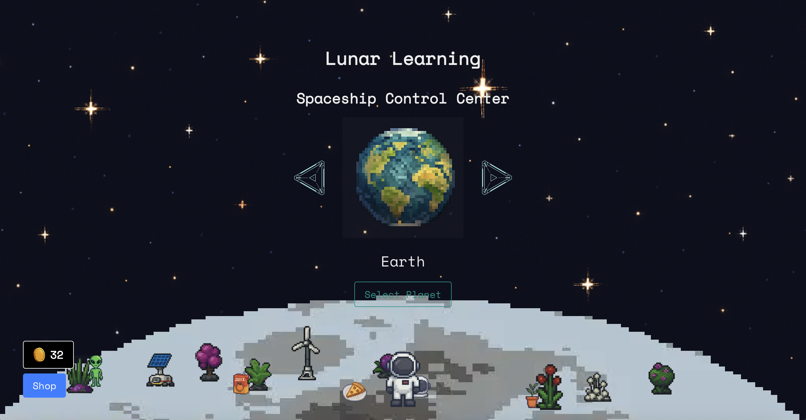

# Lunar Learning



**Lunar Learning** is an interactive, space-themed science game designed specifically to engage elementary school students with learning disabilities. By transforming traditional science lessons into exciting missions, Lunar Learning turns learning into an adventure where kids become astronauts exploring the solar system, solving problems, and earning rewards.

## Pitch

### Hook / Problem

What if school felt like a frustrating puzzle you were never meant to solve? Many younger students with learning disabilities feel confused, discouraged, and disengaged by traditional classrooms. Standard teaching methods often fail to capture their attention or adapt to their unique needs.

### Our Solution

Lunar Learning transforms elementary science into a space adventure. Students launch their learning journey from their customizable Moon base and navigate the solar system by visiting planets in any order. Each planet is themed around a different science topic—turning lessons on plants and animals, solids, liquids, and gases, or rocks and minerals into interactive missions.

- **Engaging Gameplay:** Navigate through planets with intuitive left/right controls.
- **Interactive Question Sets:** Each planet challenges students with custom, fun questions.
- **Reward System:** Earn coins for correct answers to personalize your Moon base with unlockable space-themed items.
- **Adaptive Support:** Integrated Gemini AI provides real-time fun facts, hints, and encouraging messages.
- **Achievement Recognition:** Plant a flag on each planet upon completing its challenges, celebrating every success.

## Features

- **Spaceship Control Center:**  
  Navigate the solar system using an interactive control panel. Choose which planet to explore next and see a flag appear on completed planets.

- **Planet-Specific Challenges:**  
  Each planet features a different science topic with custom questions. For example:

  - **Mercury (Anatomy):** Learn about your body’s senses and organs.
  - **Venus (Scientific Thinking):** Practice the scientific method and critical thinking.
  - **Earth (Plants and Animals):** Discover how plants and animals live and interact.
  - **Mars (Rocks and Minerals):** Explore the world of rocks and minerals.
  - **Jupiter (Natural Disasters):** Understand natural disasters.
  - **Saturn (Space and the Solar):** Learn about the solar system.
  - **Uranus (Water Cycle and Weather):** Delve into weather and the water cycle.
  - **Neptune (Solids, Liquids, Gas):** Explore the states of matter.

- **Reward & Customization System:**  
  Earn coins for each correct answer and use them to purchase space-themed decorations for your Moon base.

- **Adaptive Hints & Encouragement:**  
  Gemini AI generates fun facts, hints, and positive prompts to support and motivate learners.

- **Accessibility Focus:**  
  Designed for neurodiverse learners with clear visuals, self-paced gameplay, and adaptive support.

## Tech Stack

- **Next.js:** A modern framework for server-rendered React applications.
- **React:** For building reusable UI components.
- **Tailwind CSS:** For rapid, responsive styling.
- **Gemini AI:** To generate real-time hints, fun facts, and encouraging messages.
- **Local Storage:** For progress persistence, including tracking completed planets and user customization.

## Getting Started

### Prerequisites

- **Node.js** (version 14 or later)
- **npm** or **yarn**

### Installation

1. **Clone the Repository:**

   ```bash
   git clone https://github.com/yourusername/lunar-learning.git
   cd mission_learn

   ```

2. **Install Dependencies:**

   ```bash
   npm install
   # or
   yarn install

   ```

3. **Set Environment Variables:**
   Create a .env.local file in the project root and add your Gemini API key:

   ```bash
   NEXT_PUBLIC_SECRET_KEY=your_gemini_api_key_here

   ```

4. **Running the Project:**
   Start the development server:
   ```bash
   npm run dev
   ```

Open http://localhost:3000 in your browser to see Lunar Learning in action.

## Contributing

Our contributors:

- **Uday**
- **Bee**
- **Zidane**
- **Syd**

Feel free to fork the repository, make improvements, and submit a pull request. We welcome your feedback and contributions!

## Impact & Future Vision

Lunar Learning aims to make science education engaging and accessible for every student—especially those facing learning challenges. In the future, we plan to:

- Expand to additional subjects.
- Introduce multiplayer cooperative missions.
- Collaborate with educators to bring Lunar Learning into classrooms.

Every child deserves to feel smart, capable, and curious. Lunar Learning is our way of making learning an adventure.

## License

This project is licensed under the [MIT License](LICENSE).

---

Happy coding, and blast off into learning!
